## Welcome to Vibe Kanban

**Vibe Kanban** is a task management system designed for AI-assisted development. It provides isolated workspaces, multi-agent support, and visual code review—everything you need to orchestrate AI coding agents effectively.

<Frame>
  
</Frame>

<Tip>
  **Looking for advanced features?** Check out the **InDusk** tab for workflow automation, context compounding, and intelligent agent orchestration.
</Tip>

---

## Core Features

<CardGroup cols={2}>
  <Card title="Multi-Agent Support" icon="users" href="/supported-coding-agents">
    Switch between Claude Code, OpenAI Codex, Amp, Cursor CLI, Gemini, and more.
  </Card>

  <Card title="Git Worktree Isolation" icon="code-branch" href="/core-features/creating-tasks">
    Each task runs in an isolated branch. Safe parallel execution.
  </Card>

  <Card title="Visual Code Review" icon="code-compare" href="/core-features/reviewing-code-changes">
    Review AI changes with line-by-line diffs, add comments, and send feedback.
  </Card>

  <Card title="GitHub Integration" icon="github" href="/integrations/github-integration">
    Create PRs, manage branches, and sync with GitHub.
  </Card>
</CardGroup>

---

## Get Started

<CardGroup cols={2}>
  <Card title="Installation" icon="download" href="/getting-started">
    Install and run Vibe Kanban
  </Card>

  <Card title="Your First Project" icon="folder-plus" href="/core-features/creating-projects">
    Create a project and start working with AI agents
  </Card>

  <Card title="Configure Agents" icon="robot" href="/configuration-customisation/agent-configurations">
    Set up and customize your coding agents
  </Card>

  <Card title="Keyboard Shortcuts" icon="keyboard" href="/configuration-customisation/keyboard-shortcuts">
    Learn the shortcuts for faster navigation
  </Card>
</CardGroup>

---

## How It Works

```mermaid
flowchart LR
    subgraph Project["📁 Project"]
        Task1[Task 1]
        Task2[Task 2]
        Task3[Task 3]
    end

    subgraph Workspaces["🌿 Isolated Workspaces"]
        WT1[Worktree 1]
        WT2[Worktree 2]
        WT3[Worktree 3]
    end

    subgraph Agents["🤖 AI Agents"]
        A1[Claude Code]
        A2[Codex]
        A3[Gemini]
    end

    Task1 --> WT1 --> A1
    Task2 --> WT2 --> A2
    Task3 --> WT3 --> A3

    style WT1 fill:#fff3e0
    style WT2 fill:#fff3e0
    style WT3 fill:#fff3e0
```

1. **Create a task** with a description of what you want built
2. **Vibe Kanban creates an isolated workspace** (git worktree) for the task
3. **An AI agent works on the task** in complete isolation
4. **Review the changes** with visual diffs and feedback
5. **Merge when ready** via PR or direct merge
