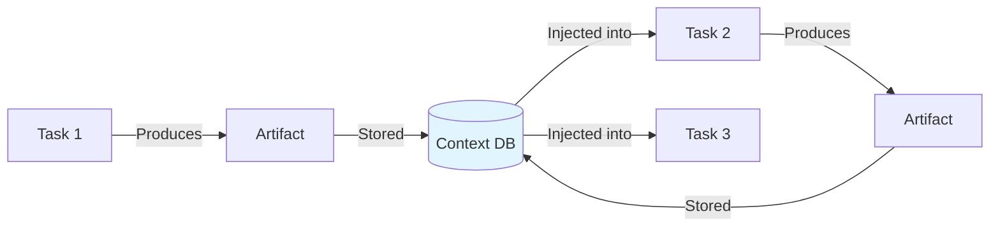

  

    
      ✨ InDusk
    
    <h1 style={{ fontSize: '2.25rem', fontWeight: 800, margin: '0.5rem 0', color: 'white' }}>Welcome to InDusk</h1>
    
Intelligent orchestration for AI-assisted development

  

## What is InDusk?

**InDusk** is a heavily enhanced fork of [Vibe Kanban](https://github.com/BloopAI/vibe-kanban). While Vibe Kanban provides solid foundations for AI agent orchestration, InDusk adds sophisticated features for workflow automation, multi-agent coordination, and continuous knowledge improvement.

<Info>
**Fork Date:** December 31, 2025
**Codename:** Infinite Dusky → InDusk
</Info>

---

## What InDusk Adds

<CardGroup cols={2}>
  <Card title="Workflow Engine" icon="diagram-project">
    Columns become states in a state machine. Define transitions, conditions, and automatic routing based on agent decisions.
  </Card>

  <Card title="Context Compounding" icon="brain">
    Every task can improve project knowledge. Agents learn from past work through a structured artifact system.
  </Card>

  <Card title="Structured Deliverables" icon="list-check">
    Define exactly what agents should output. Validate decisions against allowed options.
  </Card>

  <Card title="Task Triggers" icon="bolt">
    Create soft dependencies between tasks. "Start Task B after Task A completes."
  </Card>

  <Card title="File Locking" icon="lock">
    Prevent parallel agents from conflicting on the same files. Automatic release on task completion.
  </Card>

  <Card title="Swim Lanes & Labels" icon="tags">
    Organize tasks visually with labels and collapsible swim lanes.
  </Card>
</CardGroup>

---

## Base Vibe Kanban vs InDusk

| Feature | Base Vibe Kanban | InDusk |
|---------|------------------|--------|
| Git worktree isolation | ✅ | ✅ |
| Multi-agent support | ✅ | ✅ |
| Visual code review | ✅ | ✅ |
| GitHub integration | ✅ | ✅ |
| **Workflow state machine** | ❌ | ✅ |
| **Conditional routing** | ❌ | ✅ |
| **Context artifacts** | ❌ | ✅ |
| **Knowledge compounding** | ❌ | ✅ |
| **Structured deliverables** | ❌ | ✅ |
| **Task triggers** | ❌ | ✅ |
| **File locking** | ❌ | ✅ |
| **Board templates** | ❌ | ✅ |
| **Task labels & swim lanes** | ❌ | ✅ |

---

## Architecture Philosophy

InDusk is built on the **Agent-as-Context** model:

> Agents are not sub-process invocations but **specialized contexts** that shape LLM behaviour.

When a task enters a column:
1. **Agent's system prompt** establishes persona and expertise
2. **Task description + workflow history** provides context
3. **Column's deliverable** sets expectations
4. **Project context artifacts** inject accumulated knowledge

This approach is LLM-agnostic—works with Claude Code, Gemini, Codex, Cursor, and others.

---

## The Knowledge Loop

The key innovation in InDusk is the **continuous improvement cycle**:

Every completed task can add:
- **Architecture Decision Records (ADRs)**
- **Patterns and best practices**
- **Module-specific knowledge**
- **Implementation plans**

Future agents automatically receive this context, making them smarter with each task.

---

## Explore InDusk Features

<CardGroup cols={3}>
  <Card title="How It Works" icon="circle-play" href="/indusk/how-it-works">
    Visual overview of the entire system
  </Card>

  <Card title="Workflow Engine" icon="gears" href="/indusk/workflow-engine">
    Columns, transitions, and automation
  </Card>

  <Card title="Context System" icon="brain" href="/indusk/context-system">
    Knowledge compounding in detail
  </Card>
</CardGroup>
