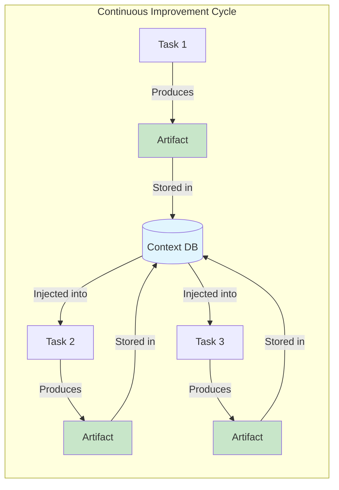
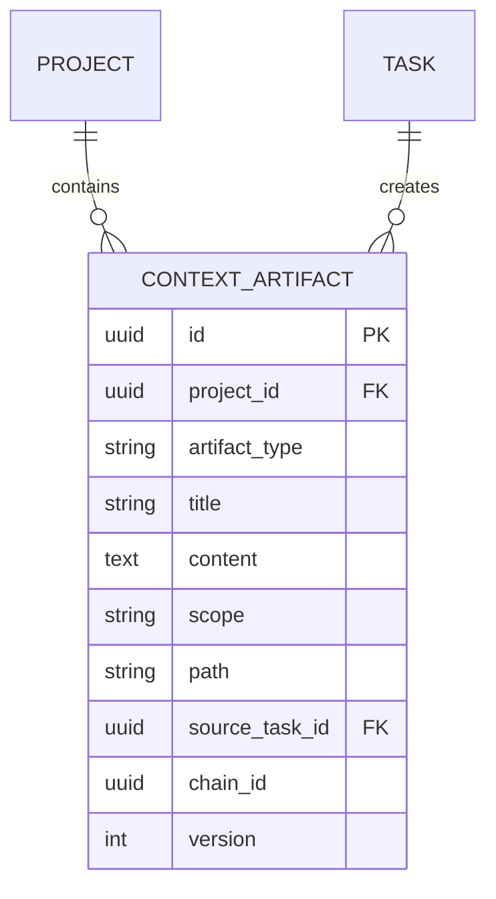
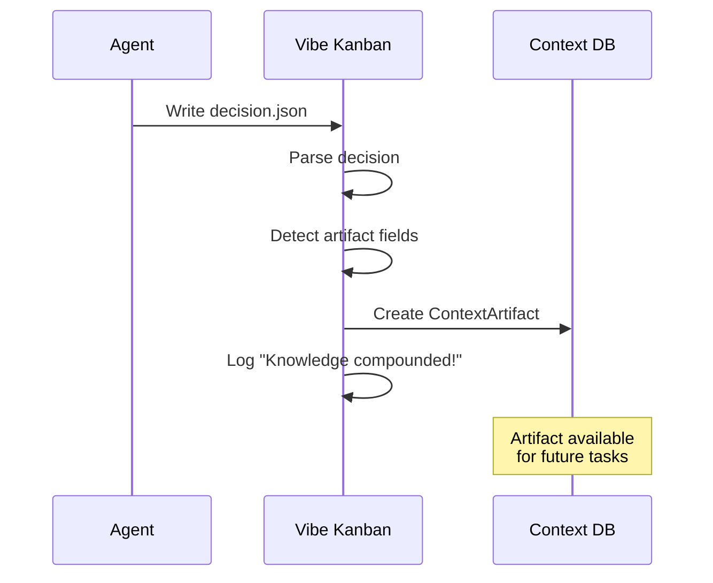
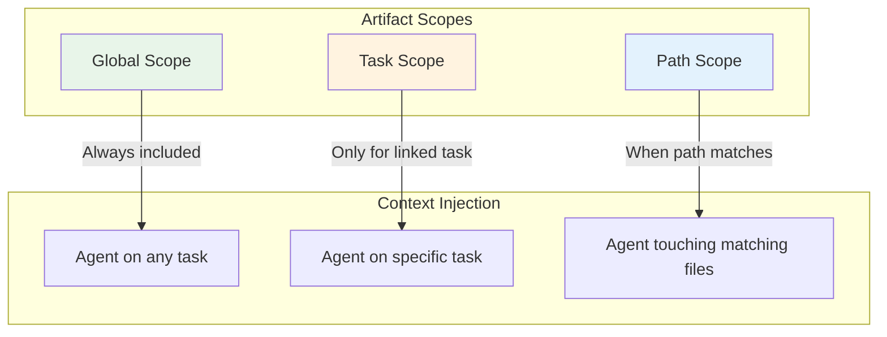
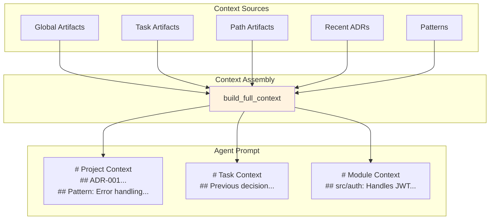
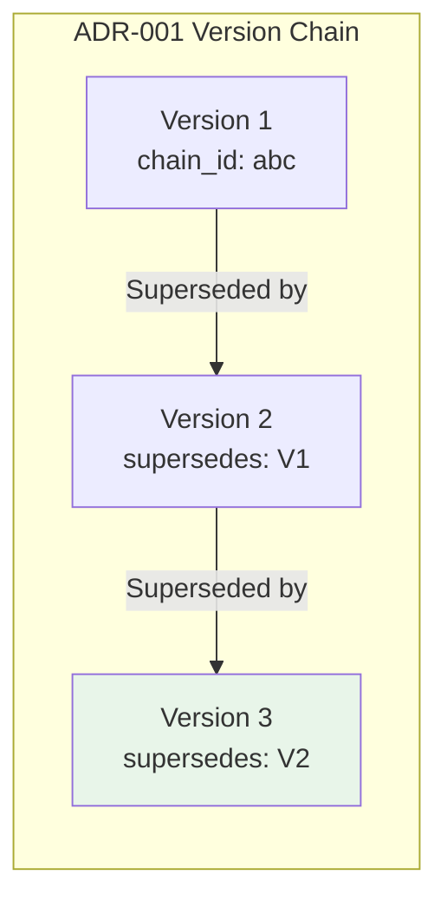
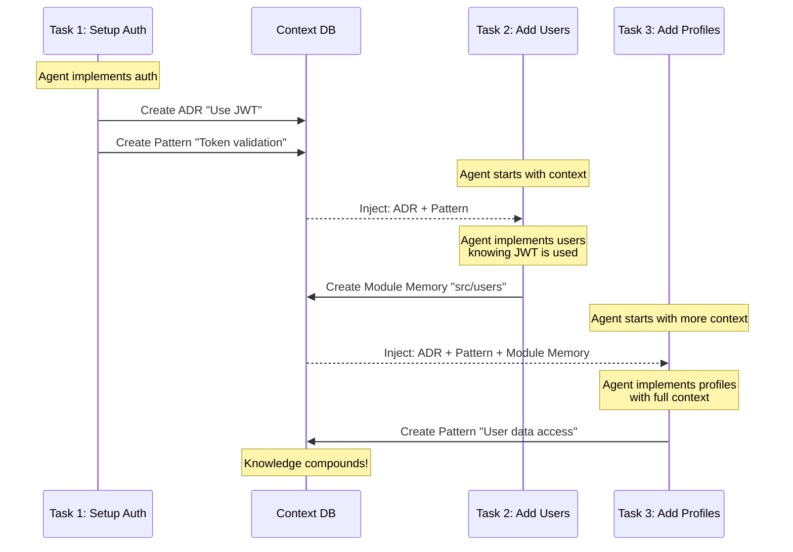

<div style={{ background: 'linear-gradient(135deg, #1a1a2e 0%, #16213e 50%, #0f3460 100%)', borderRadius: '12px', padding: '2rem', marginBottom: '2rem', color: 'white', position: 'relative', overflow: 'hidden' }}>
  <div style={{ position: 'relative', zIndex: 1 }}>
    <span style={{ display: 'inline-block', background: 'rgba(255, 255, 255, 0.15)', border: '1px solid rgba(255, 255, 255, 0.2)', padding: '0.25rem 0.75rem', borderRadius: '9999px', fontSize: '0.75rem', fontWeight: 600, textTransform: 'uppercase', letterSpacing: '0.05em', marginBottom: '1rem' }}>
      ✨ InDusk Exclusive
    </span>
    <h1 style={{ fontSize: '2.25rem', fontWeight: 800, margin: '0.5rem 0', color: 'white' }}>Context System</h1>
    <p style={{ fontSize: '1.1rem', opacity: 0.9, margin: 0 }}>How knowledge compounds and agents grow smarter over time</p>
  </div>
</div>

## The Knowledge Compounding Loop

Every task in InDusk can contribute to project knowledge. As agents work, they can create **context artifacts**—pieces of knowledge that get stored and injected into future agent prompts.



<Info>
This is **not** just RAG (retrieval-augmented generation). Artifacts are structured, scoped, and versioned—they form a living knowledge base that grows smarter with every task.
</Info>

---

## Context Artifacts

Artifacts are the building blocks of project knowledge:



### Artifact Types

| Type | Purpose | Example |
|------|---------|---------|
| `module_memory` | Knowledge about a specific file | "auth.ts validates JWTs using jose library" |
| `adr` | Architecture Decision Record | "ADR-001: Use PostgreSQL for persistence" |
| `decision` | Specific choice made | "Chose Tailwind CSS over styled-components" |
| `pattern` | Reusable code pattern | "Use React Query for server state" |
| `dependency` | Dependency information | "Uses axios 1.6.0 for HTTP requests" |
| `iplan` | Implementation plan | "Step 1: Create schema, Step 2: Add migrations" |
| `changelog_entry` | Completed work record | "Added user authentication with JWT" |

---

## How Artifacts Are Created

Agents create artifacts by including them in their decision file:

```json
{
  "decision": "approve",
  "artifact_type": "pattern",
  "title": "Error Handling Pattern",
  "content": "All async route handlers should use try/catch with proper error logging:\n\n```typescript\nasync function handler(req, res) {\n  try {\n    // ... handler logic\n  } catch (error) {\n    logger.error('Handler failed', { error });\n    res.status(500).json({ error: 'Internal error' });\n  }\n}\n```",
  "scope": "global"
}
```

When InDusk processes this decision:



---

## Artifact Scoping

Not all knowledge should be everywhere. Artifacts have **scope** that controls when they're included:



### Global Scope

**Always included** for every agent in the project. Use for:
- Architecture decisions (ADRs)
- Project-wide patterns
- Coding standards
- Key dependencies

```json
{
  "artifact_type": "adr",
  "title": "ADR-001: Use TypeScript Strict Mode",
  "content": "All TypeScript files must use strict mode...",
  "scope": "global"
}
```

### Task Scope

**Only included** when working on the specific source task. Use for:
- Task-specific context that shouldn't leak
- Implementation details for a feature
- Temporary decisions

```json
{
  "artifact_type": "decision",
  "title": "Auth Implementation Choice",
  "content": "Using Passport.js for this specific task...",
  "scope": "task"
}
```

### Path Scope

**Included when working on matching files**. Use for:
- Module-specific knowledge
- File documentation
- Component patterns

```json
{
  "artifact_type": "module_memory",
  "title": "Authentication Module",
  "content": "src/auth/ handles all authentication...",
  "scope": "path",
  "path": "src/auth"
}
```

---

## Context Building

When an agent starts, Vibe Kanban assembles context from multiple sources:



### What Gets Injected

The agent receives a structured context section:

```markdown
# Project Context

## Architecture Decisions

### ADR-001: Use PostgreSQL
We chose PostgreSQL for its JSONB support and reliability...

### ADR-002: Use TypeScript Strict Mode
All code must pass strict TypeScript checks...

## Patterns & Best Practices

### Error Handling Pattern
All async handlers should use try/catch...

---

# Task Context

## Previous Implementation Decision
Last attempt chose Passport.js for authentication...

---

# Module Context

## Module: src/auth
This module handles JWT validation using the jose library.
Key functions: validateToken(), generateToken(), refreshToken()
```

---

## Version Tracking

Artifacts can be versioned, allowing knowledge to evolve:



| Field | Purpose |
|-------|---------|
| `chain_id` | Groups all versions of the same document |
| `supersedes_id` | Points to the previous version |
| `version` | Sequential version number (1, 2, 3...) |
| `file_path` | Links to file on disk for hybrid storage |

---

## The .vibe Convention

Agents write to the `.vibe/` directory in the workspace:

```
workspace/
├── .vibe/
│   ├── decision.json    # Routing decision + optional artifact
│   ├── summary.md       # Task completion summary
│   └── context.md       # Discovered context to preserve
├── src/
└── ...
```

### decision.json

Required for workflow routing, optional artifact creation:

```json
{
  "decision": "approve",
  "feedback": "Implementation looks good",

  "artifact_type": "pattern",
  "title": "API Response Pattern",
  "content": "All API responses follow...",
  "scope": "global"
}
```

### summary.md

Agent can write a summary for human review:

```markdown
# Task Summary

## What I Did
- Implemented user authentication
- Added JWT token generation
- Created login/logout endpoints

## Key Decisions
- Used jose library for JWT (faster than jsonwebtoken)
- Tokens expire after 24 hours

## Remaining Work
- Add refresh token flow
- Add password reset
```

---

## Practical Example

Let's trace knowledge through three tasks:



### Task 1: Setup Auth

Agent produces:
```json
{
  "decision": "approve",
  "artifact_type": "adr",
  "title": "ADR-001: Use JWT for Authentication",
  "content": "We use JSON Web Tokens (JWT) for stateless authentication. Tokens are signed with RS256 and include user ID and role claims.",
  "scope": "global"
}
```

### Task 2: Add Users

Agent receives ADR-001 in context, then produces:
```json
{
  "decision": "approve",
  "artifact_type": "module_memory",
  "title": "Users Module",
  "content": "src/users/ handles user CRUD operations. Uses the JWT claims from ADR-001 to identify the current user.",
  "scope": "path",
  "path": "src/users"
}
```

### Task 3: Add Profiles

Agent receives ADR-001 + Users Module Memory, making it aware of:
- How authentication works
- How users are managed
- Where to integrate profile data

---

## Best Practices

<AccordionGroup>
<Accordion title="When to create global artifacts">
- **ADRs**: Any decision that affects the whole project
- **Patterns**: Reusable code patterns everyone should follow
- **Dependencies**: Key libraries and their usage
- **Standards**: Coding conventions, naming patterns
</Accordion>

<Accordion title="When to use path scope">
- **Module documentation**: What a file/directory does
- **Component patterns**: How a specific component works
- **API documentation**: Endpoint behavior and contracts
</Accordion>

<Accordion title="When to use task scope">
- **Temporary decisions**: Choices that might change
- **Work-in-progress notes**: Context for the current task
- **Implementation details**: Specifics that shouldn't affect other work
</Accordion>

<Accordion title="Writing good artifact content">
- Be concise but complete
- Include code examples where helpful
- Explain the "why" not just the "what"
- Reference related artifacts or files
- Keep content up to date
</Accordion>
</AccordionGroup>

---

## What's Next?

<CardGroup cols={2}>
  <Card title="Workflow Engine" icon="diagram-project" href="/indusk/workflow-engine">
    Learn how to configure columns and transitions
  </Card>

  <Card title="Agent Configuration" icon="robot" href="/configuration-customisation/agent-configurations">
    Configure agents with system prompts
  </Card>
</CardGroup>
