<div style={{ background: 'linear-gradient(135deg, #1a1a2e 0%, #16213e 50%, #0f3460 100%)', borderRadius: '12px', padding: '2rem', marginBottom: '2rem', color: 'white', position: 'relative', overflow: 'hidden' }}>
  <div style={{ position: 'relative', zIndex: 1 }}>
    <span style={{ display: 'inline-block', background: 'rgba(255, 255, 255, 0.15)', border: '1px solid rgba(255, 255, 255, 0.2)', padding: '0.25rem 0.75rem', borderRadius: '9999px', fontSize: '0.75rem', fontWeight: 600, textTransform: 'uppercase', letterSpacing: '0.05em', marginBottom: '1rem' }}>
      ✨ InDusk Exclusive
    </span>
    <h1 style={{ fontSize: '2.25rem', fontWeight: 800, margin: '0.5rem 0', color: 'white' }}>How InDusk Works</h1>
    <p style={{ fontSize: '1.1rem', opacity: 0.9, margin: 0 }}>Isolated workspaces, workflow automation, and continuous learning</p>
  </div>
</div>

## The Big Picture

InDusk is more than a task board—it's an **intelligent orchestration system** that coordinates AI agents, manages code isolation, and continuously improves project knowledge.

```mermaid
flowchart TB
    subgraph User["👤 User"]
        Task[Create Task]
    end

    subgraph VK["InDusk"]
        Board[Kanban Board]
        Column[Column with Agent]
        Workspace[Isolated Workspace]
        Context[Context System]
    end

    subgraph Agent["🤖 AI Agent"]
        Work[Do Work]
        Decision[Write Decision]
        Artifact[Create Artifact]
    end

    Task --> Board
    Board --> Column
    Column -->|"Creates"| Workspace
    Workspace -->|"Provides context"| Agent
    Context -->|"Injects knowledge"| Agent
    Work --> Decision
    Decision -->|"Routes task"| Board
    Artifact -->|"Compounds knowledge"| Context

    style Context fill:#e1f5fe
    style Workspace fill:#fff3e0
```



## Three Core Concepts

<CardGroup cols={3}>
  <Card title="Isolated Workspaces" icon="code-branch">
    Every task runs in its own git worktree. Agents can't interfere with each other or your main branch.
  </Card>

  <Card title="Workflow Engine" icon="diagram-project">
    Columns are states in a state machine. Define transitions, conditions, and automatic routing.
  </Card>

  <Card title="Context Compounding" icon="brain">
    Agents learn from each task. Knowledge accumulates in a database and injects into future work.
  </Card>
</CardGroup>

---

## 1. Isolated Workspaces

When a task starts, InDusk creates a **git worktree**—a separate checkout of your repository on a new branch.


**Benefits:**
- **Parallel execution**: Multiple agents work simultaneously without conflicts
- **Safe experimentation**: Failed attempts are easily discarded
- **Clean history**: Each task has its own branch ready for PR

---

## 2. Workflow Engine

Columns aren't just visual—they're **states in a state machine**. Each column can have:

| Property | Purpose |
|----------|---------|
| **Agent** | The AI agent assigned to work in this column |
| **Deliverable** | What the agent should produce |
| **Status Mapping** | Maps to task status (todo, in_progress, done) |
| **Transitions** | Rules for moving to other columns |


### Conditional Routing

Agents write decisions to `.vibe/decision.json`:

```json
{
  "decision": "approve",
  "feedback": "Code looks good, tests pass"
}
```

Transitions can route based on these values:
- `decision = "approve"` → Move to Done
- `decision = "reject"` → Move back to Development (with feedback)

<Card title="Learn More" icon="arrow-right" href="/indusk/workflow-engine">
  Deep dive into the workflow engine, transitions, and automation
</Card>

---

## 3. Context Compounding

This is what makes InDusk special. **Every task improves project knowledge.**


### How It Works

1. **Agent completes work** and writes to `.vibe/decision.json`
2. **Decision can include artifacts**:
   ```json
   {
     "decision": "approve",
     "artifact_type": "pattern",
     "title": "Error Handling Pattern",
     "content": "Always wrap async operations in try/catch...",
     "scope": "global"
   }
   ```
3. **InDusk stores the artifact** in the database
4. **Future agents receive this context** automatically

### Artifact Types

| Type | Purpose | Example |
|------|---------|---------|
| `pattern` | Reusable code patterns | "Use React Query for data fetching" |
| `adr` | Architecture decisions | "ADR-001: Use PostgreSQL" |
| `decision` | Specific choices made | "Chose Tailwind over CSS modules" |
| `module_memory` | Knowledge about a file/module | "auth.ts handles JWT validation" |
| `iplan` | Implementation plans | "Step 1: Create schema, Step 2: Add API" |

### Scoping

Artifacts have different visibility:

- **Global**: Always included for all agents
- **Task**: Only for a specific task
- **Path**: Included when working on matching files

<Card title="Learn More" icon="arrow-right" href="/indusk/context-system">
  Deep dive into context artifacts, scoping, and knowledge compounding
</Card>

---

## Putting It Together

Here's a complete workflow showing all three concepts:


---

## What's Next?

<CardGroup cols={2}>
  <Card title="Workflow Engine" icon="diagram-project" href="/indusk/workflow-engine">
    Learn how to configure columns, transitions, and automation rules
  </Card>

  <Card title="Context System" icon="brain" href="/indusk/context-system">
    Understand how knowledge compounds and flows between tasks
  </Card>
</CardGroup>
