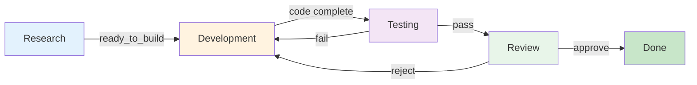
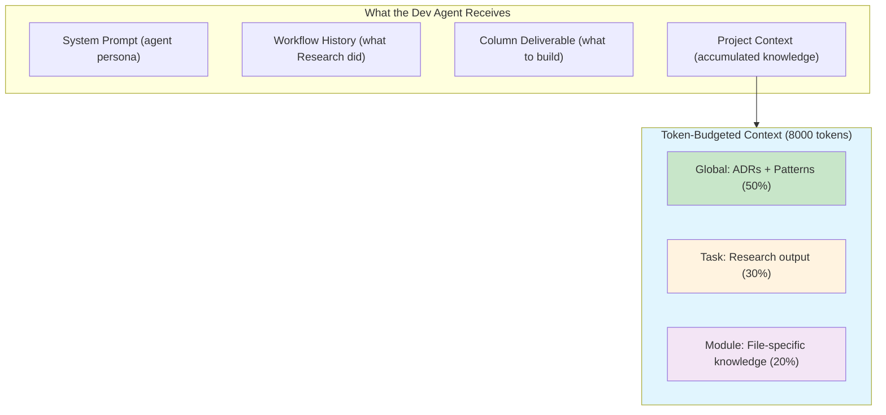
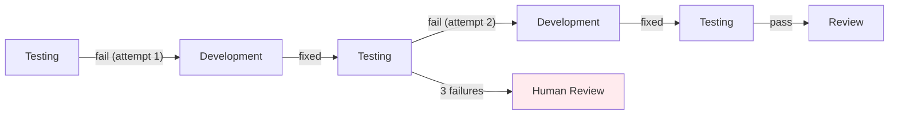
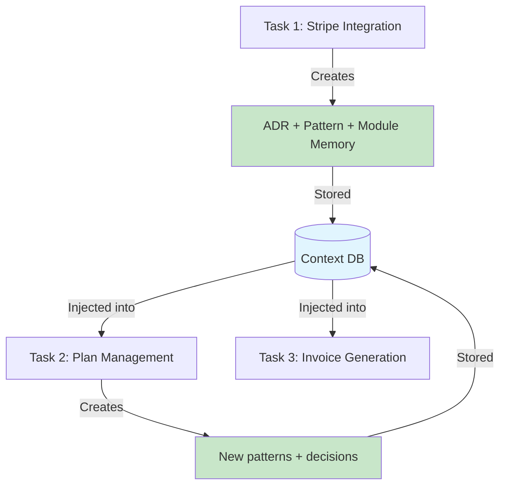

<InDuskHeader title="From Idea to Shipped Feature" subtitle="What happens when AI agents don't just execute — they learn" badge="The Story" />

## The Problem With AI Coding Today

You give an AI agent a task. It writes code. Maybe it works, maybe it doesn't. Either way, the next task starts from scratch. The agent has no memory of what it built yesterday, no awareness of your architecture decisions, no understanding of the patterns your team established three sprints ago.

Every task is a cold start.

InDusk fixes this. Here's how.

---

## Imagine You Want to Build a SaaS Billing System

You have a codebase. You need to add Stripe integration, usage tracking, plan management, and invoice generation. That's not one task -- it's a coordinated campaign of work where each piece depends on decisions made in the last.

In most AI workflows, you'd write four detailed prompts, babysit each one, and manually paste context between them. In InDusk, you write one sentence per task and the system handles the rest.

---

## Step 1: You Set Up a Pipeline

InDusk boards aren't just kanban columns -- they're **state machines**. Each column is a stage with a specific agent, a specific deliverable, and rules that control what happens next.



| Column | Agent | What It Does |
|--------|-------|-------------|
| **Research** | Analyst agent | Reads the codebase, produces an ADR and implementation plan |
| **Development** | Claude Code | Writes the actual code |
| **Testing** | Test runner agent | Runs the test suite, verifies correctness |
| **Review** | Code reviewer agent | Reviews quality, approves or sends back |

This pipeline is configured once. Every task flows through it automatically.

---

## Step 2: You Create a Task

You type:

> "Add Stripe billing integration with usage-based pricing"

That's it. You drag it from Backlog into Research. InDusk takes over.

---

## Step 3: Research -- The Agent Thinks Before It Codes

The Research column agent doesn't write code. It **analyzes**. It reads the existing codebase, understands the architecture, and produces structured deliverables:

### ADR Output

The agent creates an Architecture Decision Record:

```markdown
# ADR: Use Stripe Billing with Usage Records API

## Context
The codebase uses Express.js with PostgreSQL. We need metered billing
for API calls with monthly invoicing.

## Decision
Use Stripe's Usage Records API (not Checkout Sessions) because:
- Supports metered billing natively
- Handles proration automatically
- Our existing webhook pattern (src/webhooks/) can be extended

## Consequences
- Need stripe npm package
- Need new tables: subscriptions, usage_records
- Webhook handler needs billing event types
```

### Implementation Plan

The agent produces a plan that the next column will follow:

```markdown
# Implementation Plan: Stripe Billing

1. Add stripe package and configure API keys via environment
2. Create database migrations for subscriptions and usage tables
3. Build StripeService in src/services/stripe.ts
4. Add webhook handlers for invoice.paid, subscription.updated
5. Create usage tracking middleware that logs API calls
6. Add billing endpoints: GET /billing/usage, POST /billing/subscribe
```

These outputs aren't just text -- they're **context artifacts** stored in the database, tagged by type (`adr`, `iplan`) and scope (`global`, `task`).

::: info
The Research agent can also call the `create_artifact` MCP tool directly during its work, storing knowledge as it discovers it rather than only at the end.
:::

When the agent writes `{"decision": "ready_to_build"}` to `.vibe/decision.json`, InDusk evaluates the transition rules and automatically moves the task to Development.

---

## Step 4: Development -- The Agent That Remembers

Here's where InDusk diverges from every other AI coding tool.

When the Development agent starts, it doesn't just get the task description. It gets **assembled context** -- a budgeted, prioritized injection of everything the project has learned:



The context system (ADR-007) enforces an **8000-token budget** across three scopes. It prioritizes by type -- ADRs and patterns rank highest, changelog entries lowest. If an artifact has been revised three times, only the latest version is injected. If global scope doesn't use its full budget, the remainder rolls over to task scope.

**The Development agent knows:**
- The Stripe Usage Records API was chosen (from the ADR)
- The implementation plan has 6 steps (from the iplan)
- The webhook pattern lives in `src/webhooks/` (from a path-scoped module memory)
- The project uses PostgreSQL with a specific migration pattern (from a global pattern)

It writes the code with full context. No hallucinating a different database. No inventing a payment approach that conflicts with the plan. No reimplementing patterns that already exist.

---

## Step 5: Testing -- Automated Quality Gate

The task flows to Testing automatically. The Testing agent:

1. Receives the workflow history (what Development built)
2. Runs the existing test suite
3. Verifies the new code compiles and passes

If tests fail, it writes `{"decision": "fail"}` and the task routes **back to Development** -- with failure context attached. The Development agent sees what broke and fixes it.

If tests pass, `{"decision": "pass"}` routes the task forward.



The `max_failures` setting prevents infinite loops. After 3 failed attempts, the task escalates to a human review column where you step in.

---

## Step 6: Review -- The Final Gate

The Review agent reads the diff, checks for security issues, validates test coverage, and writes a decision:

```json
{
  "decision": "approve",
  "artifact_type": "pattern",
  "title": "Stripe Webhook Pattern",
  "content": "Billing webhooks follow the same pattern as existing webhooks in src/webhooks/. Use verifyStripeSignature() middleware before processing. Store raw event in webhook_events table for replay.",
  "scope": "global"
}
```

Two things happen:

1. **The task moves to Done.** A clean branch with the implementation is ready for PR.
2. **A new pattern is stored.** Every future task that touches billing or webhooks will receive this context automatically.

---

## The Compound Effect

Now you create the second task: "Add plan management with upgrade/downgrade flows."

This agent starts with **everything the first task produced**:

| Context Source | What It Provides |
|---------------|-------------------|
| **ADR: Use Stripe Usage Records** | Agent knows the billing approach |
| **Pattern: Stripe Webhook Pattern** | Agent follows established conventions |
| **iplan from task 1** | Agent understands the broader architecture |
| **Module memory for src/services/stripe.ts** | Agent knows what already exists |

The second task is faster, more consistent, and more correct -- because it isn't starting from zero.



By the fourth task, the agents collectively understand your billing system better than a new hire would after a week of onboarding.

---

## What Makes This Different

<CardGrid :cols="2">
  <Card title="Not Just Agents" icon="diagram-project">
    Most tools run one agent at a time with no coordination. InDusk is a **pipeline** -- research feeds development feeds testing feeds review. Each stage has a specific purpose and a specific agent persona.
  </Card>

  <Card title="Not Just Memory" icon="brain">
    RAG systems dump similar documents into prompts. InDusk has **structured, typed, scoped, versioned, token-budgeted** context. ADRs outrank changelog entries. Task-specific context stays task-specific. Stale versions get replaced.
  </Card>

  <Card title="Not Just Automation" icon="route">
    CI/CD moves code through stages. InDusk moves **intelligence** through stages. Agents make decisions, those decisions route tasks, and the knowledge produced feeds back into the system.
  </Card>

  <Card title="Not Just One Model" icon="robot">
    InDusk is LLM-agnostic. Use Claude Code for development, a different model for review, a lightweight model for testing. Each column can have a different agent with a different persona and different capabilities.
  </Card>
</CardGrid>

---

## The Technical Foundation

Under the hood, this is built on a few key systems:

**Workflow Engine** -- Columns are states with transitions. Transitions have conditions (`decision = "approve"`), fallbacks (`else_column_id`), and escalation paths (`max_failures = 3`). The engine reads `.vibe/decision.json` from the agent's workspace and routes accordingly.

**Context Budget System** -- Every artifact has a `token_estimate` (content length / 4). `build_full_context()` fills three scopes greedily -- global gets 50% of the 8000-token budget, task gets 30%, path gets 20%. Unused budget rolls over. Within each scope, artifacts are sorted by type priority (ADR > Pattern > IPlan > ModuleMemory > Decision > Dependency > ChangelogEntry), then by recency. Chain deduplication ensures only the latest version of each artifact is included.

**Isolated Workspaces** -- Every task runs in its own git worktree on its own branch. Agents can't interfere with each other. When a task moves between columns, the same branch follows -- Research and Development work on the same checkout.

**Structured Deliverables** -- Columns define what agents should output. A `deliverable_variable` of `"decision"` with `deliverable_options` of `["approve", "reject"]` means the agent must write one of those values. Invalid decisions get caught, logged, and routed to fallback paths.

---

## Try It

<Steps>
  <Step title="Create a project and assign a board">
    Use the default "Research to Review" pipeline or build your own.
  </Step>
  <Step title="Configure agents for each column">
    Assign personas, deliverables, and decision variables.
  </Step>
  <Step title="Create a task with a single sentence">
    Describe what you want built.
  </Step>
  <Step title="Drag it into the pipeline">
    Watch it flow through Research, Development, Testing, and Review.
  </Step>
  <Step title="Create the next task">
    See the compound effect -- the second task benefits from everything the first one learned.
  </Step>
</Steps>

---

## Explore the Systems

<CardGrid :cols="3">
  <Card title="How It Works" icon="circle-play" href="/indusk/how-it-works">
    Architecture overview
  </Card>

  <Card title="Workflow Engine" icon="gears" href="/indusk/workflow-engine">
    Columns, transitions, conditions
  </Card>

  <Card title="Context System" icon="brain" href="/indusk/context-system">
    Artifacts, scoping, budgets
  </Card>
</CardGrid>
