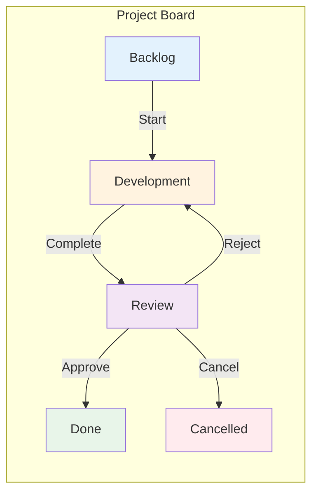
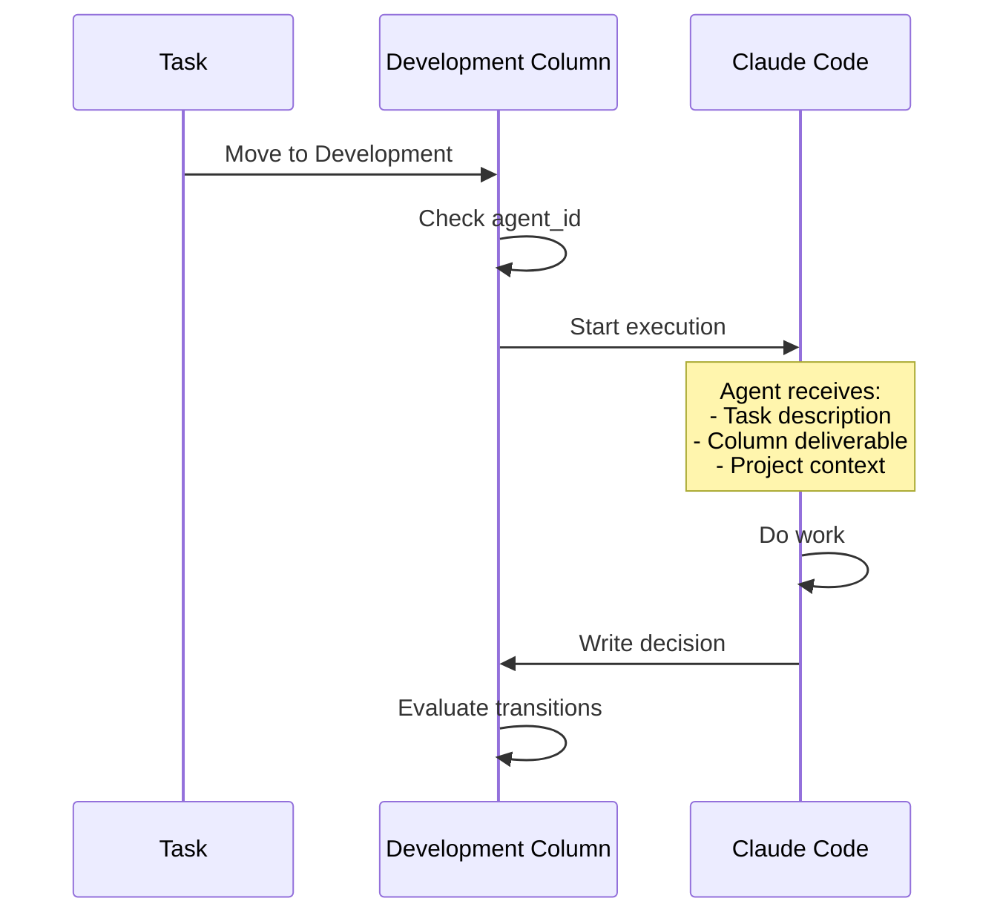
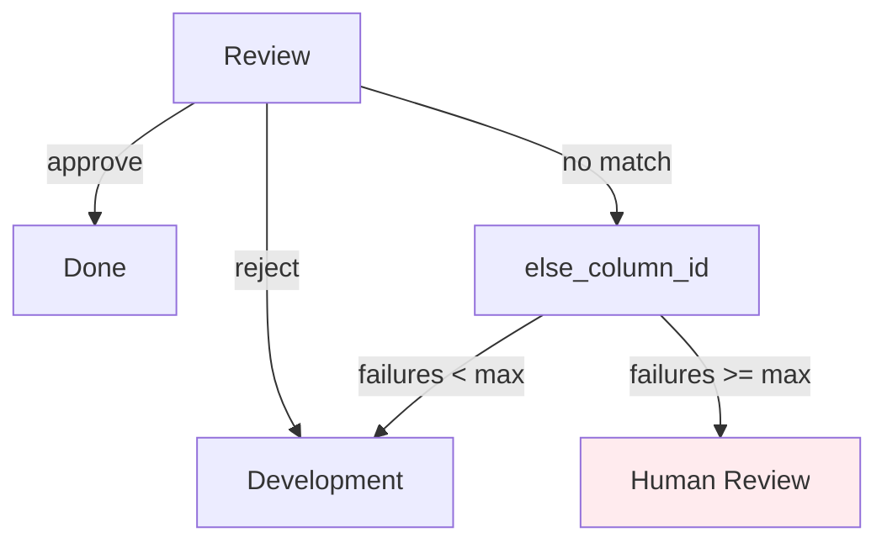
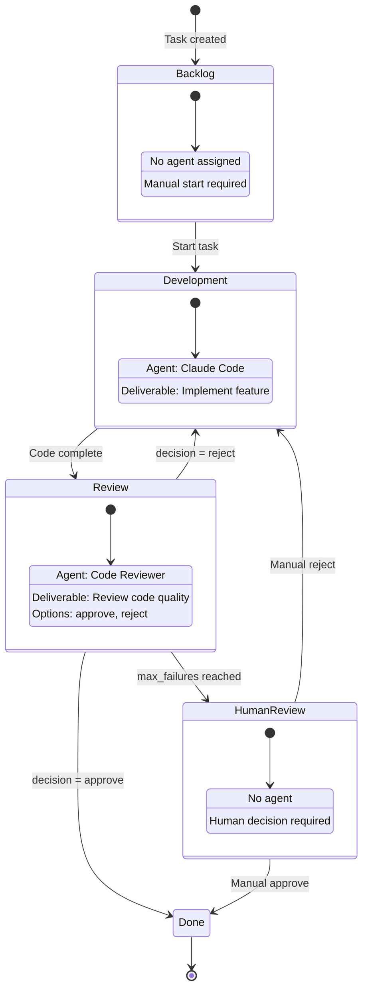

<div style={{ background: 'linear-gradient(135deg, #1a1a2e 0%, #16213e 50%, #0f3460 100%)', borderRadius: '12px', padding: '2rem', marginBottom: '2rem', color: 'white', position: 'relative', overflow: 'hidden' }}>
  <div style={{ position: 'relative', zIndex: 1 }}>
    <span style={{ display: 'inline-block', background: 'rgba(255, 255, 255, 0.15)', border: '1px solid rgba(255, 255, 255, 0.2)', padding: '0.25rem 0.75rem', borderRadius: '9999px', fontSize: '0.75rem', fontWeight: 600, textTransform: 'uppercase', letterSpacing: '0.05em', marginBottom: '1rem' }}>
      ✨ InDusk Exclusive
    </span>
    <h1 style={{ fontSize: '2.25rem', fontWeight: 800, margin: '0.5rem 0', color: 'white' }}>Workflow Engine</h1>
    <p style={{ fontSize: '1.1rem', opacity: 0.9, margin: 0 }}>Columns as states, transitions as rules, agents as actors</p>
  </div>
</div>

## Columns as States

In InDusk, each column represents a **state** in your workflow. Unlike traditional kanban boards where columns are just visual containers, here columns have behaviour:



## Column Properties

Each column has properties that control its behaviour:

| Property | Type | Description |
|----------|------|-------------|
| `name` | String | Display name (e.g., "Development") |
| `slug` | String | URL-safe identifier (e.g., "development") |
| `status` | Enum | Maps to task status: `todo`, `inprogress`, `inreview`, `done`, `cancelled` |
| `is_initial` | Boolean | New tasks start here |
| `is_terminal` | Boolean | Tasks can end here (Done, Cancelled) |
| `starts_workflow` | Boolean | Moving here auto-starts the assigned agent |
| `agent_id` | UUID | Agent assigned to this column |
| `deliverable` | String | What the agent should produce |
| `deliverable_variable` | String | Variable name for structured output (e.g., "decision") |
| `deliverable_options` | JSON | Valid values for the variable (e.g., `["approve", "reject"]`) |

---

## Assigning Agents to Columns

When a column has an assigned agent, that agent automatically starts when a task enters the column:



### Column Deliverables

The `deliverable` field tells the agent what to produce:

```
"Implement the feature described in the task.
Write tests for all new functionality.
Ensure all existing tests pass."
```

This is injected into the agent's prompt alongside the task description.

---

## State Transitions

Transitions define how tasks move between columns. Each transition has:

| Property | Description |
|----------|-------------|
| `from_column_id` | Source column |
| `to_column_id` | Destination column |
| `name` | Human-readable name (e.g., "Approve") |
| `condition_key` | Variable to check (e.g., "decision") |
| `condition_value` | Required value (e.g., "approve") |
| `requires_confirmation` | User must confirm before transition |

### Conditional Transitions

When an agent completes work, it writes to `.vibe/decision.json`:

```json
{
  "decision": "approve"
}
```

Vibe Kanban reads this file and evaluates transitions:

```mermaid
flowchart TB
    subgraph Decision["decision.json"]
        JSON['"decision": "reject"']
    end

    subgraph Transitions["From Review Column"]
        T1["Approve: decision = 'approve' → Done"]
        T2["Reject: decision = 'reject' → Development"]
        T3["Cancel: requires_confirmation → Cancelled"]
    end

    JSON --> T2
    T2 -->|"Match!"| Dev[Development]

    style T2 fill:#fff3e0
    style Dev fill:#fff3e0
```

### Fallback and Escalation

Transitions support retry logic:

| Property | Description |
|----------|-------------|
| `else_column_id` | Where to go if no condition matches |
| `escalation_column_id` | Where to go after max failures |
| `max_failures` | Failure count before escalation |



This prevents infinite loops when agents fail to produce valid decisions.

---

## Structured Deliverables

For precise control, define expected outputs on the column:

```json
{
  "deliverable_variable": "decision",
  "deliverable_options": ["approve", "reject", "needs_work"]
}
```

When set, Vibe Kanban automatically injects instructions into the agent's prompt:

```markdown
## Decision Required

Before completing, write your decision to `.vibe/decision.json`:

- `{"decision": "approve"}` → Task moves to Done
- `{"decision": "reject"}` → Task returns to Development
- `{"decision": "needs_work"}` → Task returns to Development

Example:
```json
{"decision": "approve"}
```

### Validation

InDusk validates decisions against the allowed options. If invalid:

1. Logs a warning
2. Creates a `DecisionValidationFailed` event
3. Falls back to `else_column_id` if defined
4. After `max_failures`, routes to `escalation_column_id`

This provides "soft enforcement"—agents are guided but work is never lost.

---

## Example: Code Review Workflow

Here's a complete workflow for a development team:



### Column Configuration

<Tabs>
<Tab title="Backlog">
```yaml
name: Backlog
slug: backlog
status: todo
is_initial: true
is_terminal: false
starts_workflow: false
agent_id: null  # No agent - manual start
```
</Tab>

<Tab title="Development">
```yaml
name: Development
slug: development
status: inprogress
is_initial: false
is_terminal: false
starts_workflow: true
agent_id: claude-code-agent-id
deliverable: |
  Implement the feature described in the task.
  Write comprehensive tests.
  Ensure all tests pass before completing.
deliverable_variable: null  # No structured decision needed
```
</Tab>

<Tab title="Review">
```yaml
name: Review
slug: review
status: inreview
is_initial: false
is_terminal: false
starts_workflow: true
agent_id: code-reviewer-agent-id
deliverable: |
  Review the code changes for:
  - Code quality and best practices
  - Test coverage
  - Security concerns
  - Performance implications
deliverable_variable: decision
deliverable_options: ["approve", "reject"]
```
</Tab>

<Tab title="Done">
```yaml
name: Done
slug: done
status: done
is_initial: false
is_terminal: true
starts_workflow: false
agent_id: null
```
</Tab>
</Tabs>

### Transition Configuration

```yaml
transitions:
  - name: Start Development
    from: backlog
    to: development

  - name: Submit for Review
    from: development
    to: review

  - name: Approve
    from: review
    to: done
    condition_key: decision
    condition_value: approve

  - name: Request Changes
    from: review
    to: development
    condition_key: decision
    condition_value: reject
    else_column_id: development  # Fallback if no decision
    escalation_column_id: human-review
    max_failures: 3
```

---

## Board Templates

InDusk includes pre-built board templates:

<CardGroup cols={2}>
  <Card title="Simple Kanban" icon="table-columns">
    Basic To Do → In Progress → Done workflow
  </Card>

  <Card title="Code Review Pipeline" icon="code-pull-request">
    Development → Review → Done with agent routing
  </Card>
</CardGroup>

Templates include:
- Pre-configured columns with agents
- Transition rules with conditions
- Default deliverables and validation

Apply a template from **Project Settings → Board → Apply Template**.

---

## What's Next?

<CardGroup cols={2}>
  <Card title="Context System" icon="brain" href="/indusk/context-system">
    Learn how agents learn from each task and compound knowledge
  </Card>

  <Card title="Agent Configuration" icon="robot" href="/configuration-customisation/agent-configurations">
    Configure agents with system prompts and roles
  </Card>
</CardGroup>
